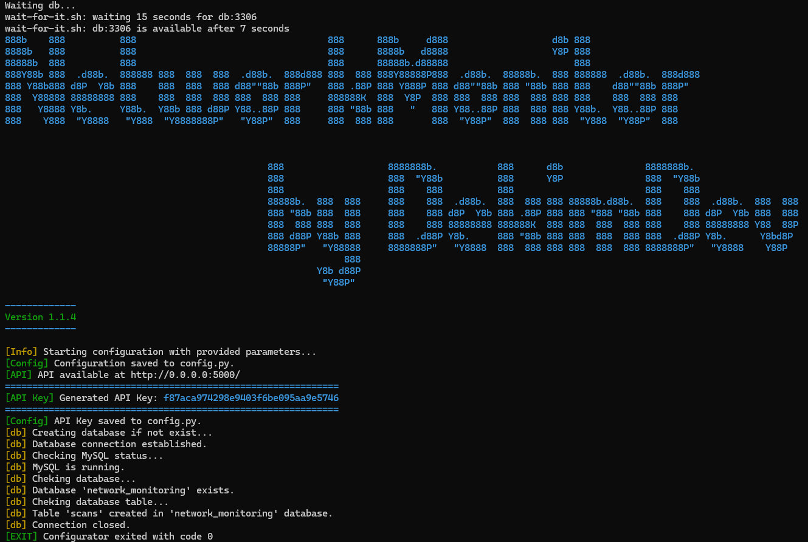

<p align="center" width="100%">
     
     
     
</p>

---

# NetworkMonitor (nmap, socket)<br>RestAPI (flask, flasgger)<br>DB (MySQL)

## 👉 [DockerHub repository](https://hub.docker.com/r/dekimasc/networkmonitor)

## Installation in using `Docker`:

- Installation in using `docker-compose`:<br>
    Create a new file named `docker-compose.yml` with the following content:
    ```yml
    version: '3.8'

    services:
      app:
        image: dekimasc/networkmonitor:latest
        volumes:
          - .:/app
        depends_on:
          - db
        ports:
          - "5000:5000"
        environment:
          NETWORK: 192.168.1.0/24
          PORTS: 22,443,80
          INTERVAL: 1.0
          DB_HOST: db
          DB_USER: root
          DB_PASSWORD: mysecretpassword
          DB_NAME: network_monitoring
          FLASK_HOST: 0.0.0.0
          FLASK_PORT: 5000
          FLASK_DEBUG: True
          SPD_TEST: True

      db:
        image: mysql:5.7
        restart: always
        environment:
          MYSQL_ROOT_PASSWORD: mysecretpassword
          MYSQL_DATABASE: network_monitoring
        volumes:
          - db_data:/var/lib/mysql
          - ./base.sql:/docker-entrypoint-initdb.d/base.sql

    volumes:
      db_data:
    ```
    *Replace the values of `NETWORK`, `PORTS`, `INTERVAL`, etc. with yours*<br>
    Run `docker-compose up -d` *(or `docker compose up -d` if you use `docker-compose-plugin` for `Docker CE`)* to start the containers.
    
- Using `docker run`<br>
  You can use the following command to run the container:
  - Run **MySQL** container:
      ```
      docker run -d --name network_monitor_db -e MYSQL_ROOT_PASSWORD=mysecretpassword -e MYSQL_DATABASE=network_monitoring -v db_data:/var/lib/mysql -v $(pwd)/base.sql:/docker-entrypoint-initdb.d/base.sql mysql:5.7
      ```
  - Run **app** container:
      ```
      docker run -d --name network_monitor_app --link mysql_db:db -p 5000:5000 -e NETWORK=192.168.1.0/24 -e PORTS=22,443,80 -e INTERVAL=1.0 -e DB_HOST=db -e DB_USER=root -e DB_PASSWORD=mysecretpassword -e DB_NAME=network_monitoring -e FLASK_HOST=0.0.0.0 -e FLASK_PORT=5000 -e FLASK_DEBUG=True dekimasc/networkmonitor:latest
      ```

      *Replace the values of `NETWORK`, `PORTS`, `INTERVAL`, etc. with yours*
---

## Installation in local machine

```shell
git clone https://github.com/QueenDekim/NetworkMonitor.git
cd ./NetworkMonitor
python -m venv venv
.\venv\Scripts\activate
pip install -r requirements.txt
```

Install `mysql` and execute the command from the `base.sql` file in it

Install `nmap`:
 - Windows - [installer (exe)](https://nmap.org/dist/nmap-7.95-setup.exe)
 - Ubuntu - `sudo apt install nmap`
 - Other OS - [link](https://nmap.org/book/inst-other-platforms.html)

Run `network_monitor.py` and select Configure or Scan
```
Choose an option:
1. Configure
2. Scan
3. Generate/Regenerate API Key
4. SpeedTest
```

In `Configure`, you can enter data for logging into the database, Flask parameters (API), and standard values for the fields for entering scan parameters (if you press `Enter` without specifying the data, the default value will be used):
```log
[Config] Configure your settings:
Database Host (default: localhost):
Database User (default: root): user
Database Password (default: password):
Database Name (default: network_monitoring):
Flask Host (default: 0.0.0.0):
Flask Port (default: 5000):
Flask Debug (default: True):
Default Network to Scan (default: 192.168.1.0/24): 10.10.123.0/24
Default Ports to Scan (default: 22,80,443): 22,80,443
Default Scan Interval (minutes, default: 1): 1
[Config] Configuration saved to config.py.
```

In the `Scan`, specify the scan parameters (if you press `Enter` without specifying the data, the default value will be used):

*To scan multiple subnets at once, specify them separated by a space (192.168.1-8.0/24 10.10.1-120.0/24 5.16.8-63.0/24)*


---

Using with arguments:<br>
Try `python network_monitor.py -h`:
```log
usage: network_monitor.py [-h] [--config | --scan] [--network NETWORK] [--ports PORTS] [--interval INTERVAL] [--db_host DB_HOST] [--db_user DB_USER] [--db_password DB_PASSWORD] [--db_name DB_NAME]
                          [--flask_host FLASK_HOST] [--flask_port FLASK_PORT] [--flask_debug FLASK_DEBUG] [--default_network DEFAULT_NETWORK] [--default_ports DEFAULT_PORTS]
                          [--default_interval DEFAULT_INTERVAL] [--spd_test SPD_TEST]

Network Monitor v1.1.2

options:
  -h, --help            show this help message and exit
  --config              Run configuration
  --scan                Run scan

Scan Arguments:
  --network NETWORK     Network to scan
  --ports PORTS         Ports to scan
  --interval INTERVAL   Scan interval in minutes

Configuration Arguments:
  --db_host DB_HOST     Database Host
  --db_user DB_USER     Database User
  --db_password DB_PASSWORD
                        Database Password
  --db_name DB_NAME     Database Name
  --flask_host FLASK_HOST
                        Flask Host
  --flask_port FLASK_PORT
                        Flask Port
  --flask_debug FLASK_DEBUG
                        Flask Debug (True/False)
  --default_network DEFAULT_NETWORK
                        Default Network
  --default_ports DEFAULT_PORTS
                        Default ports
  --default_interval DEFAULT_INTERVAL
                        Default interval
  --spd_test SPD_TEST   Speedtest before scan
```
For configuration only use 
```
python network_monitor.py --config --db_host <host> --db_user <user> --db_password <password> --db_name <db name> --flask_host <flask host> --flask_port <flask port> --flask_debug <True/False> --default_network <network> --default_ports <ports> --default_interval <interval> --spd_test <True/False>
```
For scan use
```
python network_monitor.py --scan --network <network> --ports <ports> --interval <interval>
```

---

After information about the found devices appears, try making a `GET` request to `<your ip>:<port(default 5000)>/api/scans`

Response example in `Json` format:
```json
[
 [
   1,
   "10.10.123.1",
   "up",
   "{\"ports\": [{\"name\": \"ssh\", \"port\": 22, \"state\": \"closed\", \"product\": \"\", \"version\": \"\"}, {\"name\": \"http\", \"port\": 80, \"state\": \"closed\", \"product\": \"\", \"version\": \"\"}, {\"name\": \"https\", \"port\": 443, \"state\": \"closed\", \"product\": \"\", \"version\": \"\"}], \"hostname\": \"\"}",
   "Fri, 08 Nov 2024 07:07:50 GMT"
   "example1.com",
   "0f:55:5d:7a:09:06"
 ],
 [
   2,
   "10.10.123.2",
   "up",
   "{\"ports\": [{\"name\": \"ssh\", \"port\": 22, \"state\": \"closed\", \"product\": \"\", \"version\": \"\"}, {\"name\": \"http\", \"port\": 80, \"state\": \"closed\", \"product\": \"\", \"version\": \"\"}, {\"name\": \"https\", \"port\": 443, \"state\": \"closed\", \"product\": \"\", \"version\": \"\"}], \"hostname\": \"\"}",
   "Fri, 08 Nov 2024 07:07:51 GMT",
  "example2.com",
  "00:15:5d:7b:09:07"
 ]
]
```
if you want to get information about a specific device, send a `GET` request to `<your ip>:<port(default 5000)>/api/scans/<device ip address>`

Response example in `Json` format:
```json
[
  1,
  "10.10.123.1",
  "up",
  "{\"ports\": [{\"name\": \"ssh\", \"port\": 22, \"state\": \"closed\", \"product\": \"\", \"version\": \"\"}, {\"name\": \"http\", \"port\": 80, \"state\": \"closed\", \"product\": \"\", \"version\": \"\"}, {\"name\": \"https\", \"port\": 443, \"state\": \"closed\", \"product\": \"\", \"version\": \"\"}], \"hostname\": \"\"}",
  "Fri, 08 Nov 2024 07:07:50 GMT",
  "example.com",
  "00:15:5d:7b:09:06"
]
```

---

- ### API documentation - `<ip>:<port(default 5000>/apidocs`

---

|                                                links                                                                         |                                 description                                         |
|:----------------------------------------------------------------------------------------------------------------------------:|:-----------------------------------------------------------------------------------:|
|https://net.dekimdev.ru/                                                                                                      |                                     Demo                                            |
|[](https://about:blank)                  |                                My Discord tag                                       |
|[](https://t.me/QueenDek1m)                          |                                  My telegram                                        |
